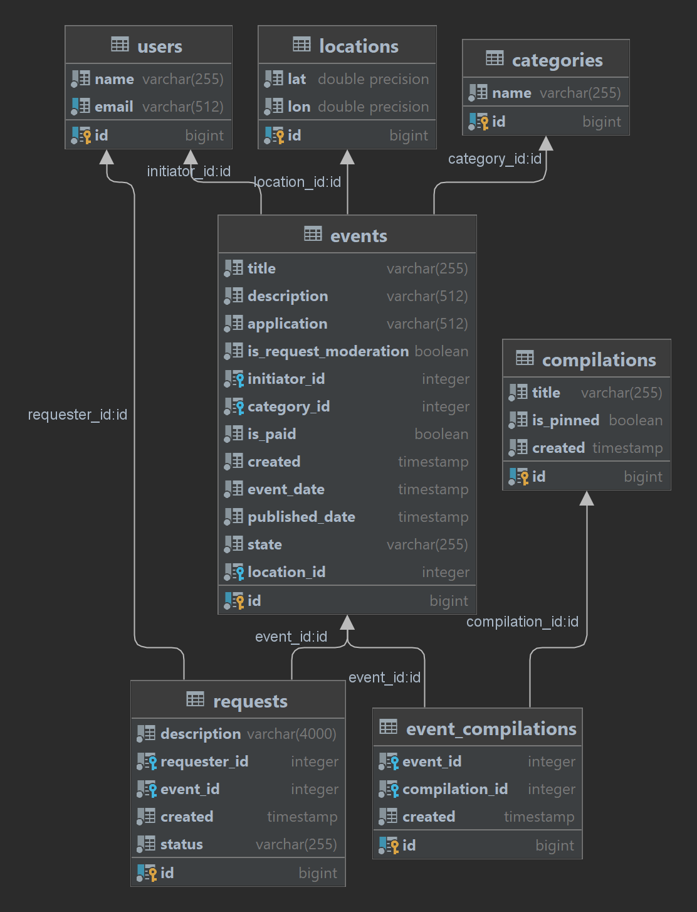
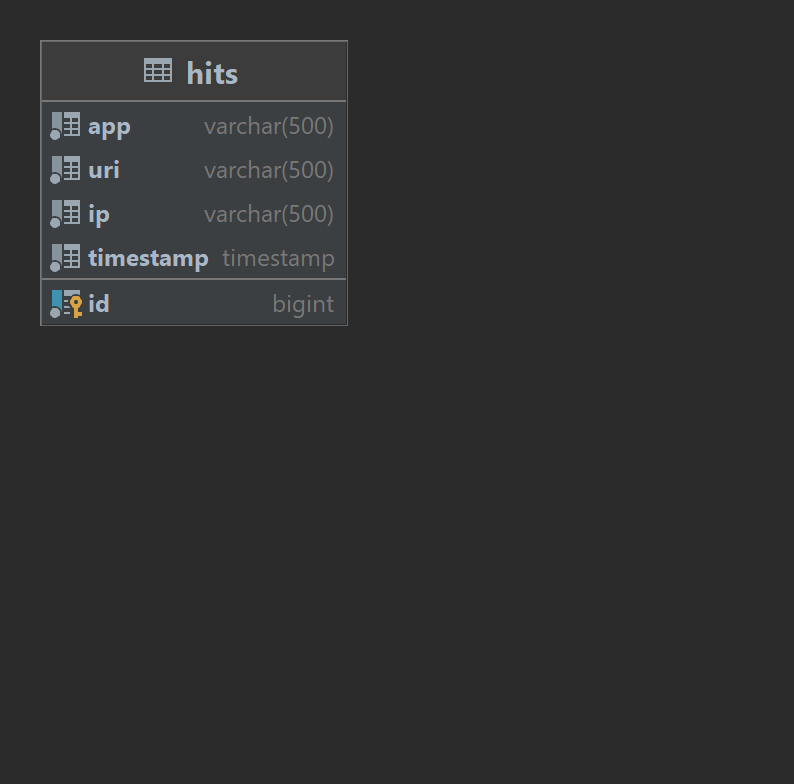

# Java-explore-with-me

## Это репозиторий проекта "Explore-with-me"
#### Реализован функционал, согласно представленному ТЗ

Приложение состоит из двух модулей:

Первый модуль main сервер:
1. Имеет публичный и административный режим, а также режим приватный режим пользователя
2. Регистрирует и хранит данные пользователей.
3. Хранит данные событий, которые размещают зарегистрированные пользователи. Пользователи и администратор могут их редактировать.
4. Пользователи могут оставлять запросы на участие событий. Инициаторы событий - подтверждают запросы и отклоняют запросы.
   Диаграмма базы данных модуля:

Запуск модуля осуществляется через файл:
ExploreServer пакета server


Второй модуль сервер статистики:
1. Хранит данные статистики запросов пользователей через публичный контролер событий.
2. Предоставляет данные статистики
   Диаграмма базы данных модуля:
   
   Запуск модуля осуществляется через файл:
   ExploreServer
   Запуск модуля осуществляется через файл:
   ExploreStatistic пакета statistic

Для работы приложения необходимо запускать два файла одновременно.
Возможен запуск через docker-compose.yml в основном каталоге проекта
Приложение написано на Java. Пример кода:
```java
public class Main {
    public static void main(String[] args) {
    }
}